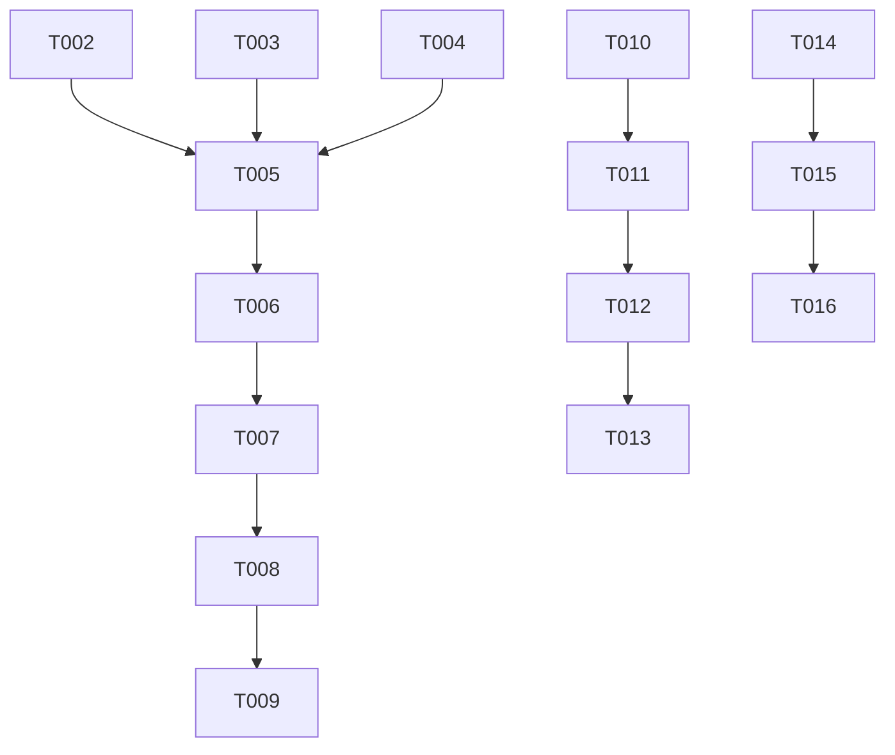

# Implementation Tasks: Task Timeout Escalation

**Feature**: Task Timeout Escalation | **Branch**: `030-task-timeout-escalation`

## Phase 1: Setup

- [ ] T001 Create project structure per implementation plan

## Phase 2: Foundational

- [ ] T002 [P] Extend Todo struct with timeout escalation fields in internal/project/project.go
- [ ] T003 [P] Create AdaptiveTimeoutConfig struct in internal/project/project.go
- [ ] T004 Extend frontmatter parsing to handle new timeout fields in internal/project/project.go

## Phase 3: User Story 1 - Receive Timeout Warnings (P1)

**Goal**: Users receive warnings before their task times out so they can take action to prevent loss of work.

**Independent Test**: Can be fully tested by configuring a task with a short timeout and timeout_warning, then verifying the warning hook executes.

### Implementation Tasks

- [ ] T005 [US1] Add timeout warning tracking to RunningTask struct in internal/daemon/daemon.go
- [ ] T006 [US1] Implement timeout warning monitoring goroutine in internal/daemon/daemon.go
- [ ] T007 [US1] Add on_timeout_warning hook execution logic in internal/daemon/daemon.go
- [ ] T008 [US1] Update anvil ps to show timeout warning countdowns in cmd/anvil/main.go

### Tests

- [ ] T009 [P] [US1] Create integration test for timeout warning functionality in internal/daemon/daemon_test.go

## Phase 4: User Story 2 - Adaptive Timeouts Based on Progress (P2)

**Goal**: Timeouts automatically extend when tasks show progress so legitimate long-running work isn't terminated prematurely.

**Independent Test**: Can be fully tested by configuring a task with adaptive timeout enabled, creating checkpoint files during execution, and verifying timeout extension.

### Implementation Tasks

- [ ] T010 [US2] Implement checkpoint file detection logic in internal/daemon/daemon.go
- [ ] T011 [US2] Add adaptive timeout extension logic in internal/daemon/daemon.go
- [ ] T012 [US2] Track timeout extensions in RunningTask in internal/daemon/daemon.go

### Tests

- [ ] T013 [P] [US2] Create integration test for adaptive timeout functionality in internal/daemon/daemon_test.go

## Phase 5: User Story 3 - Custom Timeout Escalation Hooks (P3)

**Goal**: Users can define custom actions that execute when timeout warnings occur so they can implement their own escalation procedures.

**Independent Test**: Can be fully tested by configuring custom on_timeout_warning and on_timeout hooks and verifying they execute with appropriate timing.

### Implementation Tasks

- [ ] T014 [US3] Add on_timeout hook execution logic in internal/daemon/daemon.go
- [ ] T015 [US3] Ensure proper error handling and logging for all timeout hooks

### Tests

- [ ] T016 [P] [US3] Create integration test for custom timeout hook execution in internal/daemon/daemon_test.go

## Phase 6: Polish & Cross-Cutting Concerns

- [ ] T017 Update documentation with new timeout escalation features
- [ ] T018 Add comprehensive unit tests for new data model fields
- [ ] T019 Ensure backward compatibility with existing timeout functionality
- [ ] T020 Add example tasks to quickstart guide

## Dependencies

## Parallel Execution Opportunities

- Tasks T002, T003, T004 can be implemented in parallel (all in internal/project/project.go)
- Tests T009, T013, T016 can be implemented in parallel (different test files)
- Implementation tasks within each user story phase can often be parallelized:
  - US1: T005, T006 can be developed in parallel
  - US2: T010, T011, T012 involve different aspects of adaptive timeout
  - US3: T014, T015 are sequential but can be developed after US1

## Implementation Strategy

**MVP Focus**: Start with User Story 1 (timeout warnings) as it delivers the core value proposition. The warning functionality can be implemented and tested independently before moving to adaptive timeouts and custom hooks.

**Incremental Delivery**:
1. Phase 1-2: Data model extensions
2. Phase 3: Basic timeout warnings (MVP)
3. Phase 4: Adaptive timeouts
4. Phase 5: Custom hooks
5. Phase 6: Polish and documentation

This approach ensures that each increment delivers working functionality that can be tested and validated before proceeding to the next.