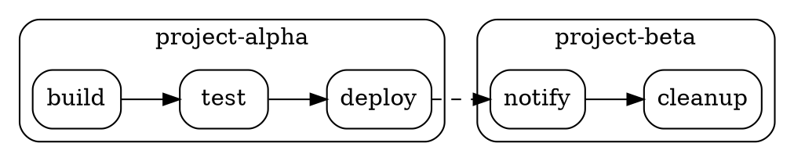

# CLI Contract: anvil task pipeline

## Command

```
anvil task pipeline [--all] [--dot] [--verbose]
```

No changes to flags or arguments. All changes are in output format.

## ASCII Output (--all mode with cross-project deps)

```
=== project-alpha ===
build
├── test
│   └── deploy

=== project-beta ===
[project-alpha] deploy
└── notify
    └── cleanup
```

### Rules

- Project headers: `=== <project-name> ===` on their own line
- Cross-project dependency shown as `[source-project] task-name` in the tree
- Local dependencies shown as plain `task-name` (no brackets)
- Projects separated by blank line + header
- Single-project mode (no `--all`): identical to current output (no headers, no brackets)
- Empty projects (no pipeline tasks) are omitted

## ASCII Output (--all --verbose)

```
=== project-alpha ===
build [*/5 * * * *] ✓ success
├── test [*/10 * * * *] ✓ success
│   └── deploy [0 9 * * *] ✗ failed

=== project-beta ===
[project-alpha] deploy [0 9 * * *] ✗ failed
└── notify [0 10 * * *] - no runs
```

## DOT Output (--dot --all)



### DOT Rules

- Each project in a `subgraph cluster_<sanitized_name>` block
- Node IDs use qualified `project:task` format
- Node labels show only the task name (no project prefix)
- Local edges: default solid style
- Cross-project edges: `[style=dashed]`
- Single-project mode (no `--all`): identical to current DOT output (no subgraphs)

## Stderr Output

Warnings and errors go to stderr (unchanged):

```
WARNING: project-beta:notify depends on "project-alpha:deploy" which does not exist
ERROR: Circular dependency detected: project-alpha:build -> project-beta:test -> project-alpha:build
```
